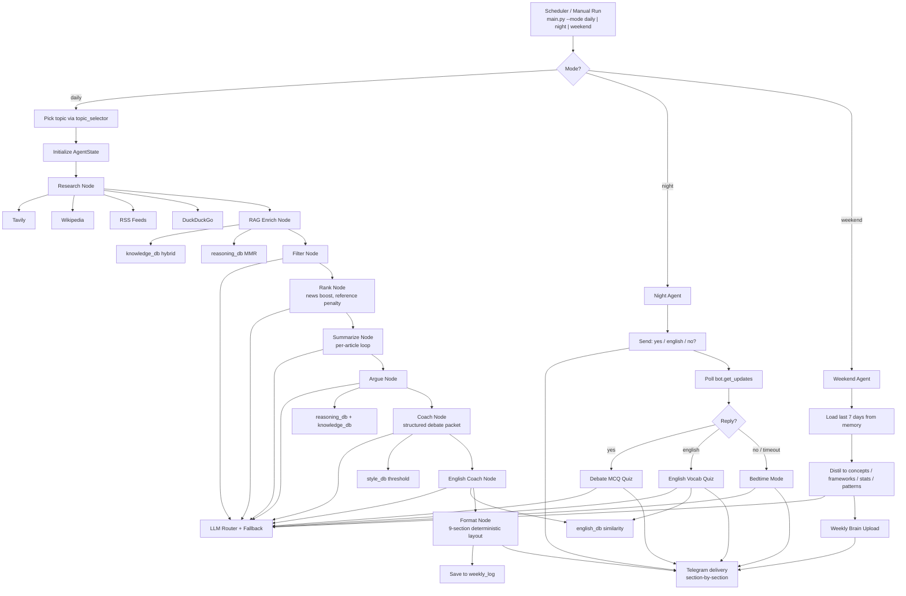

# 🎤 DebateIQ Agent

> A fully automated, multi-agent AI system that researches one topic per day, coaches you in your own style, quizzes you at night, and uploads only the knowledge worth keeping — delivered straight to Telegram. Zero budget.

---

> [!NOTE]
> **This is an open-source project — fork it freely.** Your personal study
> history (`memory/weekly_log.json`) is kept in your fork's GitHub Actions
> cache, never in git history.
>
> **New here? Start with [docs/FORKING_GUIDE.md](docs/FORKING_GUIDE.md)** — a
> complete walkthrough from "click Fork" to "messages arriving on my phone
> every morning", including how to rewrite topics for your subject and load
> your own PDFs into the RAG pipeline.
>
> Want the deep architectural tour? Read [handbook/DebateIQ_Handbook.pdf](handbook/DebateIQ_Handbook.pdf) — a 48-page learning handbook with diagrams, every design decision, and a bug-archaeology chapter.

## The Problem

Engineering student. Active debater. Zero time to read articles on feminism, geopolitics, religion, finance. This agent does all of it automatically and delivers debate-ready intelligence every morning.

> The project is subject-agnostic. Forkers have adapted it for USMLE / NEET-PG revision, UPSC prep, and system-design interview practice. See [examples in the forking guide](docs/FORKING_GUIDE.md#examples-for-different-subjects).

---

## How It Works

Three pipelines run on autopilot:

**Daily (08:00 IST, weekdays)**
Research → RAG Enrich → Filter → Rank → Summarize → Argue → Coach → English Coach → Format → Telegram

**Nightly (22:30 IST, weekdays)**
Night Agent pings you → `yes` triggers a 5-question MCQ quiz → `english` triggers a vocabulary quiz → `no` triggers a 100-word bedtime summary

**Weekend (Sunday 09:00 IST)**
Weekend Agent reads the full week → filters out news, keeps only concepts and frameworks worth memorising → sends Weekly Brain Upload

> Times are configurable — see [docs/FORKING_GUIDE.md §12](docs/FORKING_GUIDE.md#12-adjust-the-schedule-for-your-timezone) for converting to your timezone.

---

## Agent Breakdown

| Agent | LLM lane | What it does |
|---|---|---|
| Research Agent | — (tool calls) | Pulls articles from RSS, Tavily, Wikipedia, DuckDuckGo in parallel |
| RAG Enrich Agent | — (FAISS retrieval) | Pulls your private PDFs into the prompt context |
| Filter Agent | Llama 3.1 8B (`fast`) | Deduplicates and removes low-quality sources |
| Rank Agent | Llama 3.1 8B (`fast`) | Scores and picks top 5–7 articles; promotes news, demotes encyclopedia |
| Summarize Agent | Llama 3.3 70B (`balanced`) | Per-article SUMMARY / KEY FACT / CONCEPT |
| Argue Agent | Qwen3 32B (`reasoning`) | 3 FOR + 3 AGAINST + 1 middle-ground argument |
| Coach Agent | GPT-OSS 120B (`best`) | Structured debate packet — unique angle, value clash, judge language, power phrases |
| English Coach Agent | GPT-OSS 20B (`structured`) | Vocabulary lesson grounded in Word Power Made Easy chunks |
| Format Agent | — (deterministic) | Compiles all of the above into a 9-section Telegram-ready digest |
| Night Agent | — | Routes by reply: `yes` → debate quiz, `english` → vocab quiz, anything else → bedtime |
| Quiz Agent | GPT-OSS 20B (`structured`) | 5-question MCQ, exact-letter scoring, saves to memory |
| English Quiz Agent | GPT-OSS 20B (`structured`) | Vocabulary quiz from `english_db` chunks |
| Bedtime Agent | Llama 3.3 70B (`balanced`) | Compresses today's digest into ~100 words |
| Weekend Agent | Qwen3 32B (`reasoning`) | Distils the week into concepts, frameworks, stats, argument patterns |

---

## Research Tools

| Tool | Layer | Purpose |
|---|---|---|
| RSS Feeds (feedparser) | Recency | Latest breaking news from BBC, Al Jazeera, Reuters, The Hindu, Indian Express |
| Tavily Search | Depth | Full article content, multi-perspective deep search |
| Wikipedia Tool | Background | History, definitions, foundational context |
| DuckDuckGo Search | Fallback | Backup search, no API key, no rate limits |

All four run in parallel under a 20-second global timeout. Each tool's output is normalised to the same dict shape so downstream nodes don't care which source an article came from.

---

## RAG System

What makes the lesson *personal*: four vector stores, four retrieval strategies, all served by Gemini `gemini-embedding-001` (3072-dim). FAISS on disk.

### Vector Stores

| Store | What's in it | Retrieval style |
|---|---|---|
| `knowledge_db` | Topic PDFs, news archives, Wikipedia | Hybrid: BM25 40% + Vector 60% |
| `style_db` | Your past speeches, essays, personal notes | Similarity-score-threshold (0.72) |
| `reasoning_db` | Theory books, rhetoric, YouTube transcripts | MMR (λ=0.65, fetch_k=25) |
| `english_db` | *Word Power Made Easy* (session-aware extractor) | Similarity with structured metadata per chunk |

### Why four retrieval styles

- **Hybrid on `knowledge_db`** — BM25 catches exact terms like *CEDAW* or *Article 370*. Vectors catch related concepts. Together you never miss a fact or a related idea.
- **Similarity-threshold on `style_db`** — Style is tone and pattern, not keywords. *"I strongly contend"* and *"The evidence compels us"* are the same style — only vector catches that.
- **MMR on `reasoning_db`** — Prevents returning five chunks that all argue the same point. Forces diverse perspectives for richer FOR/AGAINST generation.
- **Structured similarity on `english_db`** — Each chunk carries metadata (session number, section type) so the english quiz can ask for etymology specifically.

### Retrieval Ratios Per Node

| Node | knowledge_db | reasoning_db | style_db |
|---|---|---|---|
| RAG Enrich Node | k=6 (hybrid) | k=4 (MMR) | not used |
| Argue Node | k=3 (hybrid) | k=5 (MMR) | k=2 (threshold) |
| Coach Node | k=2 (hybrid) | k=3 (MMR) | k=5 (threshold) |

### Chunking Strategy

| Content type | Chunk size | Overlap | Reason |
|---|---|---|---|
| Topic PDFs / news / Wikipedia | 600 chars | 100 (16%) | Facts need surrounding context |
| Your speeches / notes | 400 chars | 80 (20%) | One argument point per chunk |
| Debate theory books | 720 chars | 120 (16%) | Arguments span multiple sentences |
| YouTube transcripts | 300 chars | 60 (20%) | Transcripts lack punctuation structure |
| Word Power Made Easy | 260 chars | 40 | One vocabulary entry per chunk |

### Knowledge Base Sources You Feed It

Drop your PDFs into `knowledge_base/pdfs/` and register them in `rag/sources.json`. The forking guide explains [which `doc_type` routes to which store](docs/FORKING_GUIDE.md#which-doc_type-to-use).

---

## Multi-LLM Routing

Right model for the right job. The biggest model only where quality is non-negotiable.

```
Fast tasks (filter, rank)     → Llama 3.1 8B
Summaries / bedtime           → Llama 3.3 70B
Structured output / quizzes   → GPT-OSS 20B
Argument generation           → Qwen3 32B
Long article reading          → Gemini 2.5 Flash
Debate coaching               → GPT-OSS 120B
```

If any LLM hits a rate limit, a fallback chain automatically tries the next tier so the pipeline never crashes.

---

## Nightly Logic

```
22:30 → "Did you read today's digest? Reply yes / english / no"

YES → Debate Quiz Mode
      5 MCQ questions: 2 factual, 2 argument-based, 1 application
      Student replies: "1A 2B 3C 4D 5A"
      Score sent with per-question feedback
      Result saved to weekly_log

ENGLISH → Vocabulary Quiz Mode
      Pulled from today's english_db chunks
      Mix of definition, usage, and root questions

NO / TIMEOUT → Bedtime Mode
      ~100-word compression
      1 key fact · 1 argument for · 1 argument against · 1 killer line
      Feels like a friend texting you before sleep
```

---

## Weekend Agent — What Gets Filtered

**Dropped:** news stories, time-bound events, political narratives, anything outdated in 6 months.

**Kept:**
- Named concepts — intersectionality, comparative advantage, Dunning-Kruger effect
- Thinking frameworks — how to evaluate a policy, how to assess a sovereignty claim
- Historical context that repeats in debates
- Statistical facts worth memorising long-term
- Argument patterns by name — slippery slope, whataboutism, false equivalence
- Philosophical positions — utilitarianism, social contract, positive vs negative liberty

Weekly Brain Upload also reports your study stats: days studied out of 5, average quiz score.

---

## Memory System

Flat JSON file (`memory/weekly_log.json`) — no database needed. Stores per day:

- Topic, summaries, arguments, key facts, concepts, debate angle, english lesson
- `studied: true/false` — set by Night Agent based on your reply
- `quiz_score` — percentage saved after MCQ
- `english_quiz_score` — same for vocab quiz
- UTC timestamp — agrees across dev machines and CI runners

Atomic writes via `os.replace` so a crash mid-write can't corrupt the log. Persistence between scheduler runs is via GitHub Actions cache — see [docs/STATE_PERSISTENCE.md](docs/STATE_PERSISTENCE.md).

---

## Tech Stack

| Layer | Tool | Cost |
|---|---|---|
| Orchestration | LangGraph | Free |
| LLMs | Groq (Llama, Qwen, GPT-OSS) + Google Gemini | Free tier |
| Web search | Tavily + DuckDuckGo | Free tier / Free |
| Encyclopedia | Wikipedia LangChain Tool | Free |
| News | feedparser (RSS) | Free |
| PDF parsing | PyMuPDF | Free |
| YouTube transcripts | youtube-transcript-api | Free |
| Web scraping | BeautifulSoup + requests | Free |
| Embeddings | Google `gemini-embedding-001` (3072-dim) | Free tier |
| Vector store | FAISS (local) | Free |
| Telegram delivery | python-telegram-bot | Free |
| Scheduler | GitHub Actions cron | Free |
| Memory | JSON flat file + Actions cache | Free |

**Total monthly cost: ₹0**

---

## Environment Variables

```env
# Telegram (see docs/TELEGRAM_SETUP.md)
TELEGRAM_BOT_TOKEN=     # 7123456789:AAF...
TELEGRAM_CHAT_ID=       # your chat id (a number)

# LLM providers
GROQ_API_KEY=           # console.groq.com
GOOGLE_API_KEY=         # aistudio.google.com/app/apikey

# Web search
TAVILY_API_KEY=         # tavily.com

# Optional
DEV_MODE=false                  # "true" → print to console instead of Telegram
DEBATEIQ_PROMPT_CACHE=1         # "0" → disable disk prompt cache (CI uses 0)
```

In production, these same values are set as repo secrets at Settings → Secrets → Actions. The scheduler workflow reads them at runtime.

---

## Quick Start

```bash
# 1. Clone your fork
git clone https://github.com/<you>/Debating-coach.git
cd Debating-coach

# 2. Install dependencies with uv
uv pip install --system -r requirements.txt

# 3. Fill in .env (see env vars above)

# 4. Build the vector stores
python rag/ingest.py                          # full build
python rag/ingest.py --only english_vocab     # one lane

# 5. Run any of the three modes
python main.py --mode daily --topic "your topic"
python main.py --mode night
python main.py --mode weekend
```

Full setup walkthrough (creating the bot, getting the keys, configuring GitHub Actions) is in [docs/FORKING_GUIDE.md](docs/FORKING_GUIDE.md).

---

## Folder Structure

```
Debate Coach/
├── .github/workflows/        # CI + scheduler
│   ├── ci.yml                # runs tests on every push
│   └── scheduler.yml         # cron: daily / night / weekend
├── agents/                   # one file per LangGraph node
│   ├── research_node.py
│   ├── rag_enrich_node.py
│   ├── filter_node.py
│   ├── rank_node.py
│   ├── summarize_node.py
│   ├── argue_node.py
│   ├── coach_node.py
│   ├── english_coach_node.py
│   ├── english_quiz_node.py
│   ├── format_node.py
│   ├── night_agent.py
│   ├── weekend_agent.py
│   └── topic_selector.py
├── core/                     # shared plumbing
│   ├── state.py              # AgentState TypedDict
│   ├── llm_pool.py           # all model definitions in one place
│   ├── llm_router.py         # task_type → model key
│   ├── fallback.py           # fallback proxy
│   ├── prompt_cache.py       # disk-backed LLM cache
│   ├── topic_utils.py
│   └── network_utils.py
├── delivery/
│   └── telegram.py           # Meta Telegram Bot API + reply polling
├── rag/
│   ├── ingest.py             # build FAISS indexes from sources.json
│   ├── chunking_strategy.py
│   ├── embeddings.py
│   ├── retrieval_pipeline.py # hybrid / MMR / threshold dispatch
│   ├── wpm_extractor.py      # structured Word Power Made Easy parser
│   └── sources.json          # your PDFs, URLs, YouTube channels
├── tools/                    # live data sources
│   ├── tavily_tool.py
│   ├── wiki_tool.py
│   ├── rss_tool.py
│   └── ddg_tool.py
├── memory/
│   ├── weekly_store.py       # atomic JSON writes
│   └── weekly_log.json       # gitignored — lives in Actions cache
├── knowledge_base/pdfs/      # your source material
├── faiss/                    # built indexes (gitignored)
├── tests/                    # smokes + daily e2e
├── docs/
│   ├── FORKING_GUIDE.md
│   ├── TELEGRAM_SETUP.md
│   └── STATE_PERSISTENCE.md
├── handbook/                 # 48-page learning PDF + generator
├── graph.py                  # LangGraph wiring (daily / night / weekend)
├── main.py                   # entry point — reads --mode flag
├── topics.json               # your priority subjects
├── requirements.txt
├── LICENSE                   # MIT
└── .env                      # secrets — gitignored
```

---

## Schedule

| Pipeline | Time (IST) | Days |
|---|---|---|
| Daily Digest | 08:00 | Mon – Fri |
| Night Check-in | 22:30 | Mon – Fri |
| Weekend Brain Upload | 09:00 | Sunday |

Configurable per fork — see [docs/FORKING_GUIDE.md §12](docs/FORKING_GUIDE.md#12-adjust-the-schedule-for-your-timezone).

---

## Architecture Diagram



---

## Contributing

Contributions welcome — especially:

- **New `topics.json` recipes** for different fields of study (drop one in `docs/topic_recipes/`).
- **New research tools** following the schema in `tools/`.
- **Bug reports** — open an issue with the failing mode, the full GitHub Actions log of the step that failed, and which LLM lane was active. The bug-archaeology chapter of the handbook is a good prior for triage.

Tests:

```bash
python tests/test_router.py
python tests/test_memory.py
python tests/test_weekend.py
python tests/test_rag.py
python tests/test_daily_e2e.py
```

CI runs all five on every push.

---

## License

[MIT](LICENSE). Use it, fork it, modify it, ship it. Attribution appreciated but not required.
