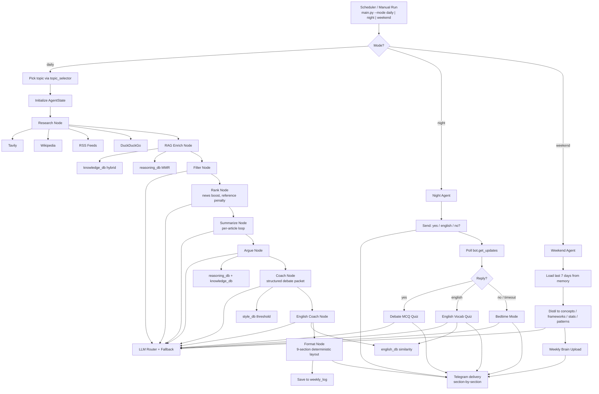

# 🎤 DebateIQ Agent

> A fully automated, multi-agent AI system that researches one topic per day, coaches you in your own style, quizzes you at night, and uploads only the knowledge worth keeping — delivered straight to Telegram. Zero budget.

---

> [!NOTE]
> **This is an open-source project — fork it freely.** Your personal study
> history (`memory/weekly_log.json`) is kept in your fork's GitHub Actions
> cache, never in git history.
>
> **New here? Start with [docs/FORKING_GUIDE.md](docs/FORKING_GUIDE.md)** — a
> complete walkthrough from "click Fork" to "messages arriving on my phone
> every morning", including how to rewrite topics for your subject and load
> your own PDFs into the RAG pipeline.
>

## The Problem

Engineering student. Active debater. Zero time to read articles on feminism, geopolitics, religion, finance. This agent does all of it automatically and delivers debate-ready intelligence every morning.

> The project is subject-agnostic. Forkers have adapted it for USMLE / NEET-PG revision, UPSC prep, and system-design interview practice. See [examples in the forking guide](docs/FORKING_GUIDE.md#examples-for-different-subjects).

---

## How It Works

Three pipelines run on autopilot:

**Daily (08:00 IST, weekdays)**
Topic Select -> Topic Foundation -> Motion Mining -> Motion Intelligence -> Motion Drafting -> Research -> RAG Enrich -> Filter -> Rank -> Summarize -> Argue -> Coach -> Vocab Enrichment -> Format -> Telegram

**Nightly (22:30 IST, weekdays)**
Night Agent pings you → `yes` triggers a 5-question MCQ quiz → `english` triggers a vocabulary quiz → `no` triggers a 100-word bedtime summary

**Weekend (Sunday 09:00 IST)**
Weekend Agent reads the full week → filters out news, keeps only concepts and frameworks worth memorising → sends Weekly Brain Upload

> Times are configurable — see [docs/FORKING_GUIDE.md §12](docs/FORKING_GUIDE.md#12-adjust-the-schedule-for-your-timezone) for converting to your timezone.

---

## Agent Breakdown

| Agent | Lane | What it does |
|---|---|---|
| Topic Foundation Agent | deterministic + search context | Teaches the topic before the article with frameworks, key concepts, and pre-knowledge |
| Topic Motion Mining Agent | tool + cache | Pulls topic-relevant motions from cached sources and `debatedata.io`, then falls back to generated templates |
| Motion Intelligence Agent | deterministic analysis | Learns common clash axes, framing patterns, and motion families from mined motions |
| Motion Drafting Agent | guidance-driven | Drafts a live-case motion, chooses a motion type probabilistically, and explains proposition/opposition burdens |
| Research Agent | tool calls | Pulls articles from RSS, Tavily, Wikipedia, and DuckDuckGo |
| RAG Enrich Agent | FAISS retrieval | Brings private PDFs, theory material, transcripts, and memory into context |
| Filter + Rank Agents | fast LLMs | Remove weak sources and select the most debate-useful article set |
| Summarize Agent | balanced LLM | Produces summary, key facts, concepts, and article context |
| Argue Agent | reasoning + guidance | Generates substantive FOR / AGAINST argument seeds tied to the motion and article |
| Coach Agent | best LLM + guidance | Expands arguments into framing, mechanisms, clash, rebuttal drills, and judge-facing coaching |
| Vocab Enrichment Agent | structured LLM + retrieval | Extracts 1-2 debate-relevant words from the actual lesson material and teaches them with definitions and examples |
| Format Agent | deterministic | Builds the final digest with motion type, burdens, arguments, coach notes, rebuttals, vocab, and recall prompts |
| Delivery Agent | Telegram section splitter | Sends the digest as section-aware Telegram messages instead of one long blob |
| Night / Quiz / Weekend Agents | deterministic + structured | Handle nightly recall, english quiz, bedtime summary, and weekly distillation |

---

## Research Tools

| Tool | Layer | Purpose |
|---|---|---|
| RSS Feeds (`feedparser`) | Recency | Pull latest news from configured feeds |
| Tavily | Depth | Pull fuller web context and multi-source article enrichment |
| Wikipedia | Background | Pull topic foundations and article-adjacent context |
| DuckDuckGo | Fallback | Cheap fallback search when API-backed retrieval is thin |
| DebateData | Motion source | Supplies real debate motions for topic-level motion mining |

The pipeline normalizes these tools into a common shape so downstream nodes can rank, summarize, and argue without caring where the source came from.

---

## RAG System

What makes the lesson personal is not just one vector search call. The project uses multiple retrieval lanes with FAISS-backed stores, selective node retrieval, and guidance-aware prompting.

### Retrieval Stores

| Store | What's in it | Why it exists |
|---|---|---|
| `knowledge_db` | Topic PDFs, curated background material, extracted articles | Factual grounding and domain knowledge |
| `reasoning_db` | Debate theory, rhetoric, transcripts, matter-style material | Better mechanism, clash, and argument structure |
| `style_db` | Personal writing / speeches / notes | Style transfer and tone alignment |
| `english_db` | Vocabulary material such as *Word Power Made Easy* | Vocabulary teaching and english quiz support |

### Retrieval Strategy

- Different nodes retrieve different mixes of stores instead of sharing one generic context blob.
- `argue_node` and `coach_node` receive targeted debate guidance slices from `debate_concepts.json` and `debate_output_contract.json` in addition to retrieved evidence.
- Retrieval memory is compacted and reused so the system can keep high-value context without exploding prompt size.
- FAISS indexes are cached in GitHub Actions and rebuilt only when source definitions or extraction logic change.

### Why this matters

This makes the output less like a generic article summary and more like a debate lesson: the system can explain motion burdens, generate argument-specific framing, and pull vocabulary from the actual lesson material rather than from a static word list.

---

## Multi-LLM Routing

Right model for the right job. The biggest model only where quality is non-negotiable.

```
Fast tasks (filter, rank)     → Llama 3.1 8B
Summaries / bedtime           → Llama 3.3 70B
Structured output / quizzes   → GPT-OSS 20B
Argument generation           → Qwen3 32B
Long article reading          → Gemini 2.5 Flash
Debate coaching               → GPT-OSS 120B
```

If any LLM hits a rate limit, a fallback chain automatically tries the next tier so the pipeline never crashes.

---

## Nightly Logic

```
22:30 → "Did you read today's digest? Reply yes / english / no"

YES → Debate Quiz Mode
      5 MCQ questions: 2 factual, 2 argument-based, 1 application
      Student replies: "1A 2B 3C 4D 5A"
      Score sent with per-question feedback
      Result saved to weekly_log

ENGLISH → Vocabulary Quiz Mode
      Pulled from today's english_db chunks
      Mix of definition, usage, and root questions

NO / TIMEOUT → Bedtime Mode
      ~100-word compression
      1 key fact · 1 argument for · 1 argument against · 1 killer line
      Feels like a friend texting you before sleep
```

---

## Weekend Agent — What Gets Filtered

**Dropped:** news stories, time-bound events, political narratives, anything outdated in 6 months.

**Kept:**
- Named concepts — intersectionality, comparative advantage, Dunning-Kruger effect
- Thinking frameworks — how to evaluate a policy, how to assess a sovereignty claim
- Historical context that repeats in debates
- Statistical facts worth memorising long-term
- Argument patterns by name — slippery slope, whataboutism, false equivalence
- Philosophical positions — utilitarianism, social contract, positive vs negative liberty

Weekly Brain Upload also reports your study stats: days studied out of 5, average quiz score.

---

## Memory System

Flat JSON file (`memory/weekly_log.json`) - no database needed. It stores daily topic, arguments, key facts, quiz results, and study state.

Persistence model:
- Local dev: the file lives directly in `memory/weekly_log.json`
- GitHub Actions: the file is restored through the Actions cache and is **not** committed back into the repository
- Writes are atomic via `os.replace`, so crashes do not corrupt the log

See [docs/STATE_PERSISTENCE.md](docs/STATE_PERSISTENCE.md) for the exact cache model and trade-offs.

---

## Tech Stack

| Layer | Tool |
|---|---|
| Orchestration | LangGraph |
| LLM routing | Groq-hosted open models + Google Gemini |
| Search | Tavily, RSS, DuckDuckGo, Wikipedia |
| Motion source | DebateData + local motion-template fallback |
| Debate guidance layer | `debate_concepts.json` + `debate_output_contract.json` + `core/debate_guidance.py` |
| PDF parsing / extraction | PyMuPDF + custom chunking |
| Embeddings | Google Gemini embeddings |
| Vector store | FAISS |
| Delivery | `python-telegram-bot` |
| Scheduler | GitHub Actions cron |
| Memory | JSON file + Actions cache |

---

## Environment Variables

```env
# Telegram (see docs/TELEGRAM_SETUP.md)
TELEGRAM_BOT_TOKEN=     # 7123456789:AAF...
TELEGRAM_CHAT_ID=       # your chat id (a number)

# LLM providers
GROQ_API_KEY=           # console.groq.com
GOOGLE_API_KEY=         # aistudio.google.com/app/apikey

# Web search
TAVILY_API_KEY=         # tavily.com

# Optional
DEV_MODE=false                  # "true" → print to console instead of Telegram
DEBATEIQ_PROMPT_CACHE=1         # "0" → disable disk prompt cache (CI uses 0)
```

In production, these same values are set as repo secrets at Settings → Secrets → Actions. The scheduler workflow reads them at runtime.

---

## Quick Start

```bash
# 1. Clone your fork
git clone https://github.com/<you>/Debating-coach.git
cd Debating-coach

# 2. Install dependencies with uv
uv pip install --system -r requirements.txt

# 3. Fill in .env (see env vars above)

# 4. Build the vector stores
python rag/ingest.py                          # full build
python rag/ingest.py --only english_vocab     # one lane

# 5. Run any of the three modes
python main.py --mode daily --topic "your topic"
python main.py --mode night
python main.py --mode weekend
```

Full setup walkthrough (creating the bot, getting the keys, configuring GitHub Actions) is in [docs/FORKING_GUIDE.md](docs/FORKING_GUIDE.md).

---

## Folder Structure

```text
Debate Coach/
|-- .github/workflows/
|   |-- ci.yml
|   `-- scheduler.yml
|-- agents/
|   |-- topic_foundation_node.py
|   |-- topic_motion_mining_node.py
|   |-- motion_intelligence_node.py
|   |-- motion_drafting_node.py
|   |-- research_node.py
|   |-- rag_enrich_node.py
|   |-- filter_node.py
|   |-- rank_node.py
|   |-- summarize_node.py
|   |-- argue_node.py
|   |-- coach_node.py
|   |-- vocab_enrichment_node.py
|   |-- format_node.py
|   |-- night_agent.py
|   `-- weekend_agent.py
|-- core/
|   |-- debate_guidance.py
|   |-- fallback.py
|   |-- network_utils.py
|   |-- prompt_cache.py
|   `-- topic_utils.py
|-- delivery/
|   |-- telegram.py
|   `-- whatsapp.py
|-- docs/
|   |-- FORKING_GUIDE.md
|   |-- STATE_PERSISTENCE.md
|   `-- TELEGRAM_SETUP.md
|-- memory/
|   |-- weekly_store.py
|   `-- weekly_log.json
|-- rag/
|   |-- ingest.py
|   |-- retrieval_memory.py
|   |-- retrieval_pipeline.py
|   |-- sources.json
|   `-- wpm_extractor.py
|-- tools/
|   |-- debatedata_tool.py
|   |-- tavily_tool.py
|   |-- wiki_tool.py
|   |-- rss_tool.py
|   `-- ddg_tool.py
|-- graph.py
|-- main.py
|-- requirements.txt
`-- topics.json
```

---

## Schedule

| Pipeline | Time (IST) | Days |
|---|---|---|
| Daily Digest | 08:00 | Mon – Fri |
| Night Check-in | 22:30 | Mon – Fri |
| Weekend Brain Upload | 09:00 | Sunday |

Configurable per fork — see [docs/FORKING_GUIDE.md §12](docs/FORKING_GUIDE.md#12-adjust-the-schedule-for-your-timezone).

---

## Architecture Diagram



---

## Contributing

Contributions welcome — especially:

- **New `topics.json` recipes** for different fields of study (drop one in `docs/topic_recipes/`).
- **New research tools** following the schema in `tools/`.
- **Bug reports** — open an issue with the failing mode, the full GitHub Actions log of the step that failed, and which LLM lane was active.

Tests:

```bash
python tests/test_router.py
python tests/test_memory.py
python tests/test_weekend.py
python tests/test_rag.py
python tests/test_daily_e2e.py
```

CI runs all five on every push.

---

## License

[MIT](LICENSE). Use it, fork it, modify it, ship it. Attribution appreciated but not required.
