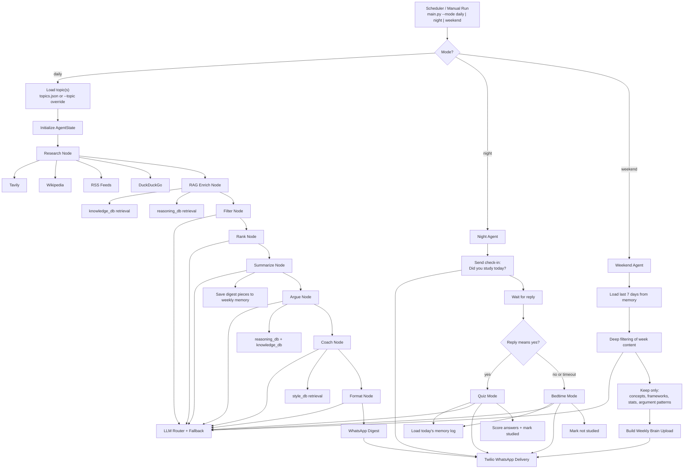

# 🎤 DebateIQ Agent
 
> A fully automated, multi-agent AI system that researches debate topics, coaches you in your own style, quizzes you at night, and uploads only the knowledge worth keeping — delivered straight to WhatsApp. Zero budget.
 
---
 
> [!IMPORTANT]
> **Keep this repository PRIVATE on GitHub.** The scheduler workflow commits
> `memory/weekly_log.json` (your topics, quiz scores, coaching prose,
> vocabulary work) back to the repo so the night/weekend agents have history
> across runs. On a public repo all of that is visible in commit history.

## The Problem
 
Engineering student. Active debater. Zero time to read articles on feminism, geopolitics, religion, finance. This agent does all of it automatically and delivers debate-ready intelligence every morning.
 
---
 
## How It Works
 
Three pipelines run on autopilot:
 
**Daily (8:00 AM IST, Weekdays)**
Research → RAG Enrich → Filter → Rank → Summarize → Argue → Coach → Format → WhatsApp
 
**Nightly (10:30 PM IST, Weekdays)**
Night Agent pings you → `yes` triggers a 5-question quiz → `no` triggers a 100-word bedtime summary
 
**Weekend (Sunday 9:00 AM IST)**
Weekend Agent reads the full week → filters out news, keeps only concepts and frameworks worth memorizing → sends Weekly Brain Upload
 
---
 
## Agent Breakdown
 
| Agent | LLM Used | What It Does |
|---|---|---|
| Research Agent | — (tool calls) | Pulls articles from RSS, Tavily, Wikipedia, DuckDuckGo |
| RAG Enrich Agent | — (FAISS retrieval) | Enriches research with your personal knowledge base |
| Filter Agent | Llama 3.1 8B (`fast`) | Deduplicates and removes low-quality sources |
| Rank Agent | Llama 3.1 8B (`fast`) | Scores and picks top 5–7 articles per topic |
| Summarize Agent | Llama 3.3 70B (`balanced`) | Bullet summaries in simple layman language |
| Argue Agent | Qwen3 32B (`reasoning`) | Generates 3 FOR, 3 AGAINST, 1 middle-ground argument |
| Coach Agent | Gemini Pro Latest (`best`) | Personalised coaching in YOUR debate style via RAG |
| English Coach Agent | GPT-OSS 20B (`structured`) | Pulls Word Power Made Easy roots/vocab for the day |
| Format Agent | GPT-OSS 20B (`structured`) | Compiles everything into a clean WhatsApp document |
| Night Agent | — | yes → debate MCQ quiz, english → vocab quiz, no → bedtime |
| Quiz Agent | GPT-OSS 20B (`structured`) | 5-question MCQ, scores you, saves to memory |
| English Quiz Agent | GPT-OSS 20B (`structured`) | Vocabulary quiz from Word Power Made Easy |
| Bedtime Agent | Llama 3.3 70B (`balanced`) | Compresses digest to ~100 words for reading in bed |
| Weekend Agent | Qwen3 32B (`reasoning`) | Extracts only memory-worthy knowledge from the week |
 
---
 
## Research Tools
 
| Tool | Layer | Purpose |
|---|---|---|
| RSS Feeds (feedparser) | Recency | Latest breaking news from BBC, Al Jazeera, Reuters, The Hindu |
| Tavily Search | Depth | Full article content, multi-perspective deep search |
| Wikipedia Tool | Background | History, definitions, foundational context |
| DuckDuckGo Search | Fallback | Backup search, no API key, no rate limits |
 
All four tools run per topic. Each serves a different layer — recency, depth, background, and redundancy.
 
---
 
## RAG System
 
The RAG system is what makes this personal, not generic. Four vector stores, four retrieval strategies, all served by Gemini `gemini-embedding-001` (3072-dim). FAISS on disk.
 
### Vector Stores
 
| Store | What's In It | Retrieval Type |
|---|---|---|
| `knowledge_db` | Topic PDFs, news archives, Wikipedia | Hybrid: BM25 40% + Vector 60% |
| `style_db` | Your speeches, debate scripts, notes | Similarity-score-threshold (0.72) |
| `reasoning_db` | Debate theory, rhetoric, YT transcripts | MMR (λ=0.65, fetch_k=25) |
| `english_db` | Word Power Made Easy (session-aware extractor) | Similarity, structured metadata on each chunk |
 
### Why Three Retrieval Types
 
- **Hybrid on knowledge_db** — BM25 catches exact terms like "Article 370" or "CEDAW". Vector catches related concepts. Together you never miss a fact or a related idea.
- **Pure semantic on style_db** — Style matching is about tone and pattern, not keywords. "I strongly contend" and "The evidence compels us" are the same style — only vector catches that.
- **MMR on reasoning_db** — Prevents returning 5 chunks that all say the same thing. Forces diverse argument perspectives for richer For/Against generation.
### Retrieval Ratios Per Node
 
| Node | knowledge_db | reasoning_db | style_db |
|---|---|---|---|
| RAG Enrich Node | 60% — k=6 | 40% — k=4 | not used |
| Argue Node | 30% — k=3 | 50% — k=5 | 20% — k=2 |
| Coach Node | 20% — k=2 | 30% — k=3 | 50% — k=5 |
 
### Chunking Strategy
 
| Content Type | Chunk Size | Overlap | Reason |
|---|---|---|---|
| Topic PDFs / News | 600 chars | 100 (16%) | Facts need surrounding context |
| Your speeches / scripts | 400 chars | 80 (20%) | One argument point per chunk |
| Debate theory books | 180 tokens | 30 tokens | Token-aware splitter, one idea per chunk |
| YouTube transcripts | 300 chars | 60 (20%) | Transcripts lack punctuation structure |
 
### Knowledge Base Sources You Feed It
 
- **PDFs** — Debate frameworks (BP, WSDC, Parliamentary), rhetoric books, logic books, your own past speeches and notes, domain topic PDFs
- **Websites** — idebate.org, debate.org, any site you add to `rag/sources.json`
- **YouTube** — Transcripts from debate competitions, TED talks, your favourite debaters via `youtube-transcript-api`
---
 
## Multi-LLM Routing
 
Right model for the right job. Gemini Pro quality only where it matters. Llama 8B speed everywhere else.
 
```
Fast tasks (filter, rank)     → Llama 3.1 8B
Summaries                     → Llama 3.3 70B
Structured output / quizzes   → Mixtral 8x7B
Argument generation           → DeepSeek R1
Long article reading          → Gemini 1.5 Flash
Debate coaching angle         → Gemini 1.5 Pro
```
 
If any LLM hits a rate limit, a fallback chain automatically tries the next best option so the pipeline never crashes.
 
---
 
## Nightly Logic
 
```
10:30 PM → "Did you read today's digest? (yes/no)"
 
YES → Quiz Mode
      5 questions: 2 factual, 2 argument, 1 application
      Student replies: "1A 2B 3C 4D 5A"
      Score sent with explanations
      Result saved to memory log
 
NO  → Bedtime Mode
      100 words max
      1 key fact · 1 argument for · 1 argument against · 1 killer line
      Feels like a friend texting you before sleep
```
 
---
 
## Weekend Agent — What Gets Filtered
 
**Filtered OUT:** News stories, time-bound events, political narratives, anything outdated in 6 months
 
**Kept:**
- Named concepts — intersectionality, comparative advantage, dunning-kruger effect
- Thinking frameworks — how to evaluate a policy, how to assess a sovereignty claim
- Historical context that repeats in debates
- Statistical facts worth memorizing long-term
- Argument patterns by name — slippery slope, whataboutism, false equivalence
- Philosophical positions — utilitarianism, social contract, positive vs negative liberty
Weekly Brain Upload also shows your study stats: days studied out of 5 and average quiz score.
 
---
 
## Memory System
 
Flat JSON file (`memory/weekly_log.json`). No database needed. Stores per day:
 
- Topic, summaries, arguments, key facts, concepts, debate angle
- `studied: true/false` — set by Night Agent based on your reply
- `quiz_score` — percentage saved after quiz
- Used by Weekend Agent every Sunday to generate the Brain Upload
---
 
## Tech Stack
 
| Layer | Tool | Cost |
|---|---|---|
| Orchestration | LangGraph | Free |
| LLMs | Groq (Llama, Mixtral, DeepSeek) + Google Gemini | Free tier |
| Web Search | Tavily + DuckDuckGo | Free tier / Free |
| Encyclopedia | Wikipedia LangChain Tool | Free |
| News | feedparser (RSS) | Free |
| PDF Parsing | PyMuPDF | Free |
| YT Transcripts | youtube-transcript-api | Free |
| Web Scraping | BeautifulSoup + requests | Free |
| Embeddings | sentence-transformers (local) | Free |
| Vector DB | ChromaDB (local) | Free |
| WhatsApp | Twilio Sandbox | Free dev tier |
| Scheduler | GitHub Actions cron | Free |
| Memory | JSON flat file | Free |
 
**Total monthly cost: ₹0**
 
---
 
## Environment Variables
 
```env
GROQ_API_KEY=           # console.groq.com
GOOGLE_API_KEY=         # aistudio.google.com
TAVILY_API_KEY=         # tavily.com
TWILIO_ACCOUNT_SID=     # twilio.com
TWILIO_AUTH_TOKEN=      # twilio.com
TWILIO_WHATSAPP_FROM=   # Twilio sandbox number
YOUR_WHATSAPP_NUMBER=   # Your number with country code
```

## Quick Start

1. Create a virtual environment.
2. Install dependencies with `uv`:

```bash
uv pip install --system -r requirements.txt
```

3. Fill in `.env`.
4. Build the vector stores:

```bash
python rag/ingest.py            # full build
python rag/ingest.py --only english_vocab    # one source only
```

5. Run a local smoke path:

```bash
python main.py --mode daily --topic feminism
python main.py --mode night
python main.py --mode weekend
```

## What Works Right Now

- Daily graph is wired end to end through delivery
- Night graph is wired end to end through reply handling fallback
- Weekend graph is wired end to end through weekly upload formatting
- All three modes degrade safely when live providers are not installed or configured

## Current Validation Commands

```bash
python tests/test_router.py
python tests/test_tools.py
python tests/test_rag.py
python tests/test_memory.py
python tests/test_weekend.py
```
 
---
 
## Folder Structure
 
```
debate-agent/
├── agents/
│   ├── research_node.py         # Tavily + Wiki + RSS + DDG per topic
│   ├── rag_enrich_node.py       # Enriches research with knowledge base
│   ├── filter_node.py           # Dedup + clean articles
│   ├── rank_node.py             # Score + pick top articles
│   ├── summarize_node.py        # Layman bullet summaries
│   ├── argue_node.py            # For / Against / Middle arguments
│   ├── coach_node.py            # Personalised coaching via style RAG
│   ├── format_node.py           # WhatsApp-ready final document
│   ├── night_agent.py           # Nightly check-in + routing
│   └── weekend_agent.py         # Weekly knowledge extraction
│
├── rag/
│   ├── ingest.py                # One-time script to build vector stores
│   ├── chunking_strategy.py     # 4 splitters for different content types
│   ├── embeddings.py            # 3 embedding model definitions
│   ├── retrieval_pipeline.py    # Unified retrieval with ratios per node
│   └── sources.json             # Your PDFs, URLs, YouTube video IDs
│
├── core/
│   ├── llm_pool.py              # All 6 LLM definitions
│   ├── llm_router.py            # task_type → LLM mapping
│   ├── state.py                 # AgentState TypedDict schema
│   └── fallback.py              # Fallback chains per route
│
├── tools/
│   ├── tavily_tool.py
│   ├── wiki_tool.py
│   ├── rss_tool.py
│   └── ddg_tool.py
│
├── memory/
│   ├── weekly_store.py          # Read/write for memory log
│   └── weekly_log.json          # Auto-generated daily log
│
├── delivery/
│   └── whatsapp.py              # Twilio send + receive
│
├── knowledge_base/
│   ├── pdfs/                    # Your debate PDFs
│   ├── websites/                # Saved website content
│   └── youtube/                 # YouTube transcript files
│
├── chroma/                      # Local vector DBs (gitignored)
│   ├── knowledge_db/
│   ├── style_db/
│   └── reasoning_db/
│
├── graph.py                     # Full LangGraph pipeline
├── main.py                      # Entry point — reads --mode flag
├── topics.json                  # ["feminism", "geopolitics", "finance" ...]
├── requirements.txt
├── .env                         # API keys (gitignored)
└── .github/workflows/
    └── scheduler.yml            # Cron for daily / nightly / weekend
```
 
---
 
## Schedule
 
| Pipeline | Time (IST) | Days |
|---|---|---|
| Daily Digest | 8:00 AM | Mon – Fri |
| Night Check-in | 10:30 PM | Mon – Fri |
| Weekend Brain Upload | 9:00 AM | Sunday |
 
---
 

